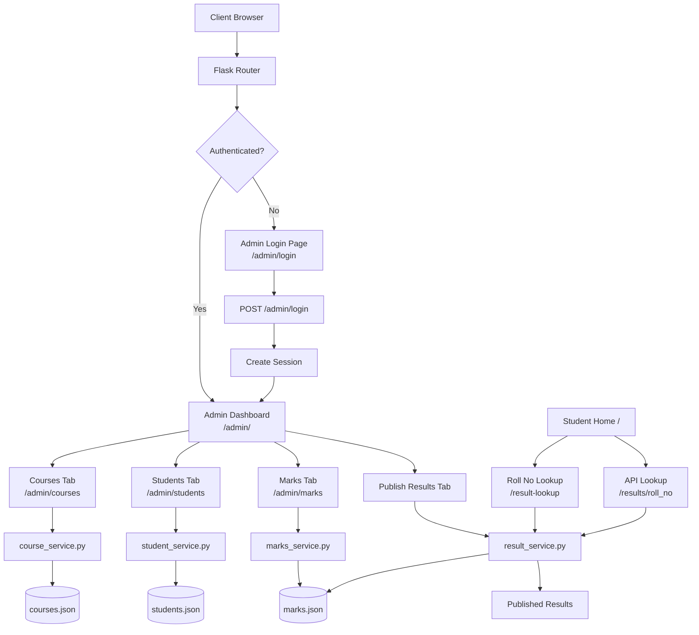
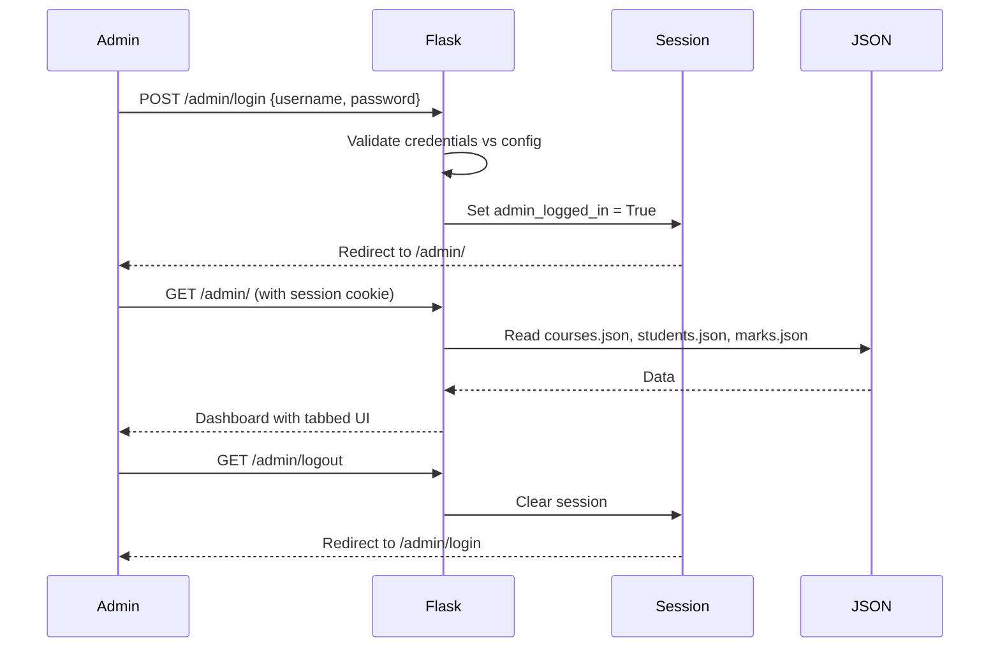
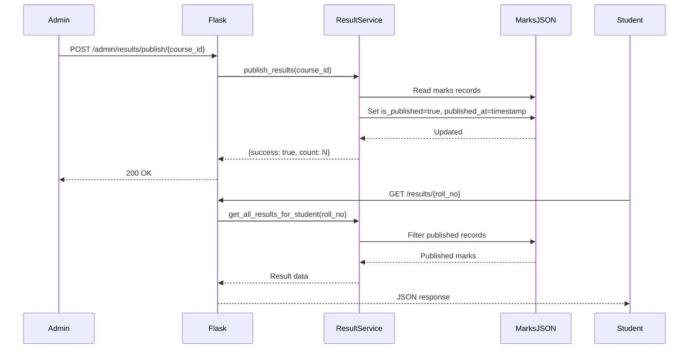

# 📚 Result Management System (RMS)


A lightweight, file-based **Result Management System** built with Flask. Admins can manage courses, students, and marks — then publish results for students to view. No database required; all data is stored in JSON files.

---

## 📋 Table of Contents

1. [Project Overview](#-project-overview)
2. [Technology Stack](#-technology-stack)
3. [Application Flow Diagram](#-application-flow-diagram)
4. [Prerequisites](#-prerequisites)
5. [Application Setup](#-application-setup)
6. [Environment Configuration](#-environment-configuration)
7. [Running the Application](#-running-the-application)
8. [Admin Credentials](#-admin-credentials)
9. [REST API Reference](#-rest-api-reference)
10. [Project Structure](#-project-structure)
11. [Data Models](#-data-models)
12. [Key Features](#-key-features)
13. [Contributing](#-contributing)
14. [License](#-license)

---

## 🎯 Project Overview

The **Result Management System (RMS)** is a web application designed to streamline the management and publication of student results. It provides a clean separation between admin operations and student-facing views.

### ✨ Key Features

| Feature | Description |
|---------|-------------|
| 📖 **Course Management** | Admin can create courses with multiple subjects; edit and delete support included |
| 👨‍🎓 **Student Onboarding** | Admin can register students with auto-generated roll numbers |
| 🔒 **Unique Constraints** | Phone + email combination must be unique per student |
| 📝 **Marks Submission** | Admin submits marks per student per course per subject |
| 📢 **Result Publishing** | Admin can publish or unpublish results course-wise |
| 🔍 **Result Lookup** | Students can look up published results by roll number |
| 📊 **Dashboard** | Tabbed admin dashboard with Students, Courses, Marks, and Publish Results tabs |
| 🔐 **Session Auth** | Secure session-based admin authentication |

---

## 🛠 Technology Stack

| Technology | Version | Purpose |
|------------|---------|----------|
| **Python** | 3.8+ | Core programming language |
| **Flask** | 3.0.0 | Web framework |
| **Werkzeug** | 3.0.1 | WSGI utilities (Flask dependency) |
| **Jinja2** | (Flask built-in) | HTML templating engine |
| **JSON Files** | — | Data storage (no database required) |
| **Bootstrap** | CDN | UI component library |
| **HTML/CSS/JS** | — | Frontend |

---

## 📊 Application Flow Diagram

### Main Application Flow



### Authentication Flow



### Result Publishing Flow



---

## 📦 Prerequisites

Before setting up the project, ensure you have the following installed:

- **Python 3.8+** — [Download Python](https://www.python.org/downloads/)
- **pip** — Python package manager (included with Python)
- **virtualenv** (optional but recommended) — `pip install virtualenv`
- **Git** (optional) — for cloning the repository

Verify your installation:

```bash
python3 --version   # Should be 3.8+
pip3 --version      # Should show pip version
```

---

## ⚙️ Application Setup

### Step 1: Get the Project

```bash
# Clone the repository (if using Git)
git clone <repository-url>
cd rms

# Or navigate to the existing project directory
cd /path/to/rms
```

### Step 2: Create a Virtual Environment

```bash
# Create virtual environment
python3 -m venv venv
```

### Step 3: Activate the Virtual Environment

```bash
# Linux / macOS
source venv/bin/activate

# Windows (Command Prompt)
venv\Scripts\activate.bat

# Windows (PowerShell)
venv\Scripts\Activate.ps1
```

You should see `(venv)` prefix in your terminal prompt.

### Step 4: Install Dependencies

```bash
pip install -r requirements.txt
```

This installs:
- `Flask==3.0.0`
- `Werkzeug==3.0.1`

### Step 5: Verify Installation

```bash
pip list | grep Flask
# Expected: Flask   3.0.0
```

---

## 🔧 Environment Configuration

The application supports the following environment variables. You can set them in your shell or create a `.env` file (requires `python-dotenv` if using `.env` files).

| Variable | Default | Description |
|----------|---------|-------------|
| `ADMIN_USERNAME` | `admin` | Admin login username |
| `ADMIN_PASSWORD` | `admin123` | Admin login password |
| `SECRET_KEY` | `rms-secret-key-change-in-production` | Flask session secret key |
| `FLASK_DEBUG` | `True` | Enable/disable debug mode (`True`/`False`) |
| `PORT` | `5000` | Port the application listens on |

### Setting Environment Variables

```bash
# Linux / macOS
export ADMIN_USERNAME=myadmin
export ADMIN_PASSWORD=mysecurepassword
export SECRET_KEY=my-very-secret-key-here
export FLASK_DEBUG=False
export PORT=8080

# Windows (Command Prompt)
set ADMIN_USERNAME=myadmin
set ADMIN_PASSWORD=mysecurepassword

# Windows (PowerShell)
$env:ADMIN_USERNAME = "myadmin"
$env:ADMIN_PASSWORD = "mysecurepassword"
```

### Using a `.env` File (Optional)

Create a `.env` file in the project root:

```env
ADMIN_USERNAME=myadmin
ADMIN_PASSWORD=mysecurepassword
SECRET_KEY=my-very-secret-key-here
FLASK_DEBUG=False
PORT=5000
```

> **Note:** To load `.env` files automatically, install `python-dotenv` and add `from dotenv import load_dotenv; load_dotenv()` at the top of `app.py`.

---

## 🚀 Running the Application

### Using Python Directly (Recommended)

```bash
python3 app.py
```

### Using Flask CLI

```bash
export FLASK_APP=app.py
flask run --host=0.0.0.0 --port=5000
```

### Expected Output

```
 * Running on http://0.0.0.0:5000
 * Running on http://127.0.0.1:5000
 * Debug mode: on
```

### Access the Application

| URL | Description |
|-----|-------------|
| `http://localhost:5000/` | Student home page |
| `http://localhost:5000/admin/login` | Admin login page |
| `http://localhost:5000/admin/` | Admin dashboard (requires login) |
| `http://localhost:5000/result-lookup` | Student result lookup page |

---

## 🔑 Admin Credentials

> ⚠️ **Security Warning**: Change the default credentials before deploying to production!

| Field | Default Value |
|-------|---------------|
| **Username** | `admin` |
| **Password** | `admin123` |
| **Login URL** | `http://localhost:5000/admin/login` |

### Changing Credentials

Set environment variables before starting the application:

```bash
export ADMIN_USERNAME=your_secure_username
export ADMIN_PASSWORD=your_secure_password
export SECRET_KEY=your-random-secret-key-min-32-chars
python3 app.py
```

> 💡 **Tip**: Generate a secure secret key with: `python3 -c "import secrets; print(secrets.token_hex(32))"`

---

## 🌐 REST API Reference

> **Note**: Admin endpoints require an active session cookie. Use `-c cookie.txt -b cookie.txt` with curl to persist the session across requests.

### Authentication Routes

#### Admin Login

```bash
# Login and save session cookie
curl -X POST http://localhost:5000/admin/login \
  -H "Content-Type: application/x-www-form-urlencoded" \
  -d "username=admin&password=admin123" \
  -c cookie.txt \
  -L
```

#### Admin Logout

```bash
curl -X GET http://localhost:5000/admin/logout \
  -b cookie.txt \
  -c cookie.txt
```

---

### Admin Dashboard

#### Get Dashboard

```bash
# View admin dashboard (HTML)
curl -X GET http://localhost:5000/admin/ \
  -b cookie.txt
```

---

### Course Management

#### List All Courses (JSON API)

```bash
curl -X GET http://localhost:5000/admin/courses \
  -H "Accept: application/json" \
  -b cookie.txt
```

**Response:**
```json
{
  "success": true,
  "data": [
    {
      "course_id": "CE34F64",
      "course_name": "Gen AI",
      "subjects": [
        {"subject_id": "SFD7535", "subject_name": "python"},
        {"subject_id": "SC12A42", "subject_name": "RAG"}
      ]
    }
  ]
}
```

#### Create a New Course (Form Submission)

```bash
curl -X POST http://localhost:5000/admin/courses \
  -H "Content-Type: application/x-www-form-urlencoded" \
  -d "course_name=Data+Science&subjects=Mathematics&subjects=Statistics&subjects=Machine+Learning" \
  -b cookie.txt \
  -c cookie.txt \
  -L
```

#### Update a Course (JSON API)

```bash
curl -X PUT http://localhost:5000/admin/courses/CE34F64 \
  -H "Content-Type: application/json" \
  -H "Accept: application/json" \
  -d '{"course_name": "Generative AI"}' \
  -b cookie.txt
```

**Response:**
```json
{
  "success": true,
  "message": "Course updated successfully.",
  "data": {"course_id": "CE34F64", "course_name": "Generative AI", "subjects": [...]}
}
```

#### Delete a Course (JSON API)

```bash
curl -X DELETE http://localhost:5000/admin/courses/CE34F64 \
  -H "Accept: application/json" \
  -b cookie.txt
```

**Response:**
```json
{"success": true, "message": "Course deleted successfully."}
```

#### Add Subject to Course

```bash
curl -X POST http://localhost:5000/admin/courses/CE34F64/subjects \
  -H "Content-Type: application/x-www-form-urlencoded" \
  -d "subject_name=Deep+Learning" \
  -b cookie.txt \
  -c cookie.txt \
  -L
```

#### Get Subjects for a Course (AJAX)

```bash
curl -X GET "http://localhost:5000/admin/marks/get_subjects?course_id=CE34F64" \
  -H "Accept: application/json" \
  -b cookie.txt
```

**Response:**
```json
{
  "subjects": [
    {"subject_id": "SFD7535", "subject_name": "python"},
    {"subject_id": "SC12A42", "subject_name": "RAG"}
  ]
}
```

---

### Student Management

#### List All Students (JSON API)

```bash
curl -X GET http://localhost:5000/admin/students \
  -H "Accept: application/json" \
  -b cookie.txt
```

**Response:**
```json
{
  "success": true,
  "data": [
    {
      "roll_no": "ROLL001",
      "name": "John Doe",
      "phone": "9876543210",
      "email": "john@example.com",
      "enrolled_courses": ["CE34F64"],
      "enrolled_course_names": ["Gen AI"]
    }
  ]
}
```

#### Onboard a New Student (Form Submission)

```bash
curl -X POST http://localhost:5000/admin/students \
  -H "Content-Type: application/x-www-form-urlencoded" \
  -d "name=Jane+Smith&phone=9876543211&email=jane@example.com&address=123+Main+St&dob=2000-05-15&enrolled_courses=CE34F64" \
  -b cookie.txt \
  -c cookie.txt \
  -L
```

#### Update a Student (JSON API)

```bash
curl -X PUT http://localhost:5000/admin/students/ROLL001 \
  -H "Content-Type: application/json" \
  -H "Accept: application/json" \
  -d '{"name": "John Updated", "address": "456 New Street"}' \
  -b cookie.txt
```

**Response:**
```json
{
  "success": true,
  "message": "Student updated successfully.",
  "data": {"roll_no": "ROLL001", "name": "John Updated", ...}
}
```

#### Delete a Student (JSON API)

```bash
curl -X DELETE http://localhost:5000/admin/students/ROLL001 \
  -H "Accept: application/json" \
  -b cookie.txt
```

**Response:**
```json
{"success": true, "message": "Student deleted successfully."}
```

#### Get Students Enrolled in a Course (AJAX)

```bash
curl -X GET "http://localhost:5000/admin/marks/get_enrolled_students?course_id=CE34F64" \
  -H "Accept: application/json" \
  -b cookie.txt
```

**Response:**
```json
{
  "students": [
    {"roll_no": "ROLL001", "name": "John Doe"}
  ]
}
```

---

### Marks Management

#### Submit Marks (Form Submission)

```bash
curl -X POST http://localhost:5000/admin/marks \
  -H "Content-Type: application/x-www-form-urlencoded" \
  -d "roll_no=ROLL001&course_id=CE34F64&marks_SFD7535=85&max_SFD7535=100&marks_SC12A42=90&max_SC12A42=100" \
  -b cookie.txt \
  -c cookie.txt \
  -L
```

#### Publish Result for a Student-Course (Form)

```bash
curl -X POST http://localhost:5000/admin/marks/publish \
  -H "Content-Type: application/x-www-form-urlencoded" \
  -d "roll_no=ROLL001&course_id=CE34F64" \
  -b cookie.txt \
  -c cookie.txt \
  -L
```

#### Unpublish Result for a Student-Course (Form)

```bash
curl -X POST http://localhost:5000/admin/marks/unpublish \
  -H "Content-Type: application/x-www-form-urlencoded" \
  -d "roll_no=ROLL001&course_id=CE34F64" \
  -b cookie.txt \
  -c cookie.txt \
  -L
```

---

### Result Publishing (Bulk Course-wise)

#### Get All Results for a Course (Admin Review)

```bash
curl -X GET http://localhost:5000/admin/results/course/CE34F64 \
  -H "Accept: application/json" \
  -b cookie.txt
```

**Response:**
```json
{
  "success": true,
  "data": {
    "course_id": "CE34F64",
    "course_name": "Gen AI",
    "results": [
      {
        "roll_no": "ROLL001",
        "student_name": "John Doe",
        "marks": [...],
        "is_published": false
      }
    ]
  }
}
```

#### Publish All Results for a Course (Bulk)

```bash
curl -X POST http://localhost:5000/admin/results/publish/CE34F64 \
  -H "Accept: application/json" \
  -b cookie.txt
```

**Response:**
```json
{
  "success": true,
  "message": "Results published for 3 student(s).",
  "count": 3
}
```

#### Unpublish All Results for a Course (Bulk)

```bash
curl -X POST http://localhost:5000/admin/results/unpublish/CE34F64 \
  -H "Accept: application/json" \
  -b cookie.txt
```

**Response:**
```json
{
  "success": true,
  "message": "Results unpublished for 3 student(s).",
  "count": 3
}
```

---

### Student-Facing Routes

#### Get All Published Results for a Student (JSON API)

```bash
curl -X GET http://localhost:5000/results/ROLL001 \
  -H "Accept: application/json"
```

**Response (success):**
```json
{
  "success": true,
  "data": {
    "roll_no": "ROLL001",
    "student_name": "John Doe",
    "results": [
      {
        "course_id": "CE34F64",
        "course_name": "Gen AI",
        "marks": [...],
        "is_published": true,
        "published_at": "2025-07-04T10:00:00"
      }
    ]
  }
}
```

**Response (not found):**
```json
{"success": false, "message": "No results found for roll number ROLL001."}
```

#### Result Lookup Page (HTML)

```bash
# Load the result lookup page
curl -X GET http://localhost:5000/result-lookup
```

#### Result Lookup (JSON API — POST)

```bash
curl -X POST http://localhost:5000/result-lookup \
  -H "Content-Type: application/json" \
  -d '{"roll_no": "ROLL001", "course_id": "CE34F64"}'
```

**Response (success):**
```json
{
  "success": true,
  "data": {
    "roll_no": "ROLL001",
    "course_id": "CE34F64",
    "course_name": "Gen AI",
    "marks": [
      {"subject_id": "SFD7535", "marks_obtained": 85, "max_marks": 100}
    ],
    "is_published": true
  }
}
```

**Response (not published):**
```json
{"success": false, "message": "Result not found or not yet published."}
```

#### Student Home Page — Course Enrollment Overview (Form POST)

```bash
# Section 1: Look up courses for a student
curl -X POST http://localhost:5000/ \
  -H "Content-Type: application/x-www-form-urlencoded" \
  -d "action=lookup_courses&roll_no_1=ROLL001"
```

#### Student Home Page — View Detailed Result (Form POST)

```bash
# Section 2: View detailed result for a student-course
curl -X POST http://localhost:5000/ \
  -H "Content-Type: application/x-www-form-urlencoded" \
  -d "action=view_result&roll_no_2=ROLL001&course_id_2=CE34F64"
```

---

### API Endpoints Summary

| Method | Endpoint | Auth Required | Description |
|--------|----------|:-------------:|-------------|
| `GET` | `/` | ❌ | Student home page |
| `POST` | `/` | ❌ | Course lookup / result view |
| `GET` | `/admin/login` | ❌ | Admin login page |
| `POST` | `/admin/login` | ❌ | Authenticate admin |
| `GET` | `/admin/logout` | ✅ | Logout admin |
| `GET` | `/admin/` | ✅ | Admin dashboard |
| `GET` | `/admin/courses` | ✅ | List all courses (JSON) |
| `POST` | `/admin/courses` | ✅ | Create new course (form) |
| `PUT` | `/admin/courses/<course_id>` | ✅ | Update course (JSON) |
| `DELETE` | `/admin/courses/<course_id>` | ✅ | Delete course (JSON) |
| `GET` | `/admin/courses/<course_id>/subjects` | ✅ | Add subject form |
| `POST` | `/admin/courses/<course_id>/subjects` | ✅ | Add subject to course |
| `GET` | `/admin/students` | ✅ | List all students (JSON) |
| `POST` | `/admin/students` | ✅ | Onboard new student (form) |
| `PUT` | `/admin/students/<roll_no>` | ✅ | Update student (JSON) |
| `DELETE` | `/admin/students/<roll_no>` | ✅ | Delete student (JSON) |
| `GET` | `/admin/marks` | ✅ | Marks submission page |
| `POST` | `/admin/marks` | ✅ | Submit marks (form) |
| `POST` | `/admin/marks/publish` | ✅ | Publish single result (form) |
| `POST` | `/admin/marks/unpublish` | ✅ | Unpublish single result (form) |
| `GET` | `/admin/marks/get_subjects` | ✅ | Get subjects for course (AJAX) |
| `GET` | `/admin/marks/get_enrolled_students` | ✅ | Get enrolled students (AJAX) |
| `GET` | `/admin/results/course/<course_id>` | ✅ | Get course results (JSON) |
| `POST` | `/admin/results/publish/<course_id>` | ✅ | Bulk publish course results |
| `POST` | `/admin/results/unpublish/<course_id>` | ✅ | Bulk unpublish course results |
| `GET` | `/results/<roll_no>` | ❌ | Get student results (JSON API) |
| `GET` | `/result-lookup` | ❌ | Result lookup page |
| `POST` | `/result-lookup` | ❌ | Lookup result by roll+course |

---

## 📁 Project Structure

```
rms/
├── app.py                    # Application factory & entry point
├── config.py                 # Configuration settings & env vars
├── requirements.txt          # Python dependencies
├── README.md                 # This file
│
├── data/                     # JSON file storage (auto-created)
│   ├── courses.json          # Course and subject data
│   ├── students.json         # Student records
│   └── marks.json            # Marks, results & publish status
│
├── routes/
│   ├── __init__.py
│   ├── auth.py               # Authentication routes & login_required decorator
│   ├── admin_routes.py       # Admin management routes (courses, students, marks, results)
│   └── student_routes.py     # Student-facing routes (home, result lookup, API)
│
├── services/
│   ├── __init__.py
│   ├── course_service.py     # Course business logic (CRUD, subject management)
│   ├── student_service.py    # Student business logic (CRUD, roll number generation)
│   ├── marks_service.py      # Marks management logic (submit, publish, calculate totals)
│   └── result_service.py     # Result publishing logic (bulk publish/unpublish, lookup)
│
├── templates/
│   ├── base.html             # Base template with navigation
│   ├── admin/
│   │   ├── login.html        # Admin login page
│   │   ├── dashboard.html    # Admin dashboard (tabbed UI)
│   │   ├── course_form.html  # Course management template
│   │   ├── add_subject.html  # Add subject to course template
│   │   ├── student_form.html # Student management template
│   │   └── marks_form.html   # Marks submission template
│   └── student/
│       ├── home.html         # Student home page
│       └── result_lookup.html # Result lookup page
│
└── static/
    ├── css/                  # Custom stylesheets
    └── js/                   # JavaScript files (AJAX, form handling)
```

---

## 🗂 Data Models

All data is persisted in JSON files within the `data/` directory.

### `courses.json`

Stores course information with nested subjects.

```json
[
  {
    "course_id": "CE34F64",
    "course_name": "Gen AI",
    "subjects": [
      {
        "subject_id": "SFD7535",
        "subject_name": "python"
      },
      {
        "subject_id": "SC12A42",
        "subject_name": "RAG"
      }
    ]
  }
]
```

| Field | Type | Description |
|-------|------|-------------|
| `course_id` | `string` | Auto-generated unique course identifier |
| `course_name` | `string` | Human-readable course name |
| `subjects` | `array` | List of subjects in the course |
| `subjects[].subject_id` | `string` | Auto-generated unique subject identifier |
| `subjects[].subject_name` | `string` | Subject name |

### `students.json`

Stores student records with enrollment information.

```json
[
  {
    "roll_no": "ROLL001",
    "name": "John Doe",
    "phone": "9876543210",
    "email": "john@example.com",
    "address": "123 Main Street, City",
    "dob": "2000-01-15",
    "enrolled_courses": ["CE34F64", "C5F6A4A"]
  }
]
```

| Field | Type | Description |
|-------|------|-------------|
| `roll_no` | `string` | Auto-generated unique roll number (e.g., `ROLL001`) |
| `name` | `string` | Student's full name |
| `phone` | `string` | Phone number (unique constraint with email) |
| `email` | `string` | Email address (unique constraint with phone) |
| `address` | `string` | Residential address |
| `dob` | `string` | Date of birth (YYYY-MM-DD format) |
| `enrolled_courses` | `array` | List of `course_id` values the student is enrolled in |

### `marks.json`

Stores marks records per student per course, including publish status.

```json
[
  {
    "roll_no": "ROLL001",
    "course_id": "CE34F64",
    "marks": [
      {
        "subject_id": "SFD7535",
        "marks_obtained": 85,
        "max_marks": 100
      },
      {
        "subject_id": "SC12A42",
        "marks_obtained": 90,
        "max_marks": 100
      }
    ],
    "published": false,
    "is_published": false,
    "published_at": null
  }
]
```

| Field | Type | Description |
|-------|------|-------------|
| `roll_no` | `string` | Student's roll number (foreign key to students.json) |
| `course_id` | `string` | Course identifier (foreign key to courses.json) |
| `marks` | `array` | List of subject-wise marks |
| `marks[].subject_id` | `string` | Subject identifier |
| `marks[].marks_obtained` | `integer` | Marks scored by the student |
| `marks[].max_marks` | `integer` | Maximum marks for the subject |
| `published` | `boolean` | Legacy publish flag (backward compatibility) |
| `is_published` | `boolean` | Current publish status |
| `published_at` | `string\|null` | ISO timestamp when result was published |

---

## ✨ Key Features

### Admin Dashboard
- **Tabbed Interface**: Students, Courses, Marks, and Publish Results tabs in a single dashboard
- **Modal Dialogs**: Edit and delete operations via modals without page reload
- **AJAX Endpoints**: Dynamic subject and student loading based on course selection

### Course Management
- Create courses with multiple subjects in one form
- Add subjects to existing courses
- Edit course names inline
- Soft-delete courses

### Student Management
- Auto-generated sequential roll numbers (ROLL001, ROLL002, ...)
- Unique phone + email constraint prevents duplicate registrations
- Multi-course enrollment support
- Edit student details and delete records

### Marks & Results
- Submit marks per subject per student per course
- Update existing marks (re-submission supported)
- Publish/unpublish results individually or in bulk (course-wise)
- Track publish timestamp for audit purposes

### Student Portal
- **Home Page**: Two-section interface — course enrollment overview + detailed result view
- **Result Lookup**: Dedicated page to look up results by roll number and course
- **JSON API**: Programmatic access to published results via `/results/<roll_no>`

### Screenshots

> 📸 _Screenshots can be added here to showcase the admin dashboard, student portal, and result lookup interface._

---

## 🤝 Contributing

Contributions are welcome! Please follow these guidelines:

1. **Fork** the repository
2. **Create** a feature branch: `git checkout -b feature/your-feature-name`
3. **Commit** your changes: `git commit -m 'feat: add some feature'`
4. **Push** to the branch: `git push origin feature/your-feature-name`
5. **Open** a Pull Request

### Code Style

- Follow **PEP 8** for Python code
- Use **type hints** for function signatures
- Add **docstrings** to all functions and classes
- Keep service functions **pure** (no direct HTTP context)
- Routes should be **thin** — delegate business logic to services

### Reporting Issues

Please use the GitHub Issues tracker to report bugs or request features. Include:
- Python version
- Flask version
- Steps to reproduce
- Expected vs actual behavior

---

## 📄 License

This project is licensed under the **MIT License**.

```
MIT License

Copyright (c) 2025 Result Management System

Permission is hereby granted, free of charge, to any person obtaining a copy
of this software and associated documentation files (the "Software"), to deal
in the Software without restriction, including without limitation the rights
to use, copy, modify, merge, publish, distribute, sublicense, and/or sell
copies of the Software, and to permit persons to whom the Software is
furnished to do so, subject to the following conditions:

The above copyright notice and this permission notice shall be included in all
copies or substantial portions of the Software.

THE SOFTWARE IS PROVIDED "AS IS", WITHOUT WARRANTY OF ANY KIND, EXPRESS OR
IMPLIED, INCLUDING BUT NOT LIMITED TO THE WARRANTIES OF MERCHANTABILITY,
FITNESS FOR A PARTICULAR PURPOSE AND NONINFRINGEMENT. IN NO EVENT SHALL THE
AUTHORS OR COPYRIGHT HOLDERS BE LIABLE FOR ANY CLAIM, DAMAGES OR OTHER
LIABILITY, WHETHER IN AN ACTION OF CONTRACT, TORT OR OTHERWISE, ARISING FROM,
OUT OF OR IN CONNECTION WITH THE SOFTWARE OR THE USE OR OTHER DEALINGS IN THE
SOFTWARE.
```

---

<div align="center">
  <p>Built with ❤️ using <a href="https://flask.palletsprojects.com/">Flask</a></p>
  <p>⭐ Star this repo if you find it useful!</p>
</div>
